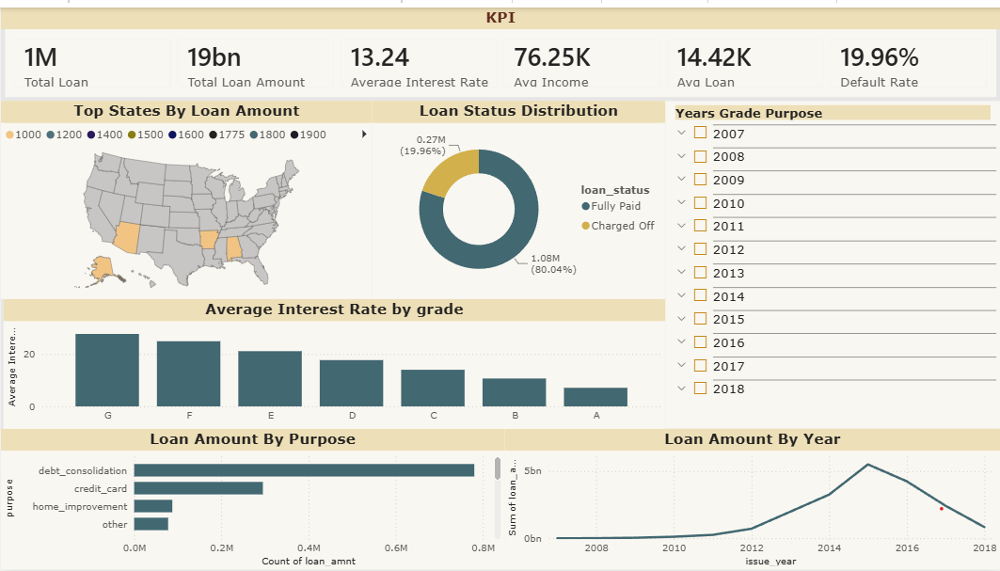
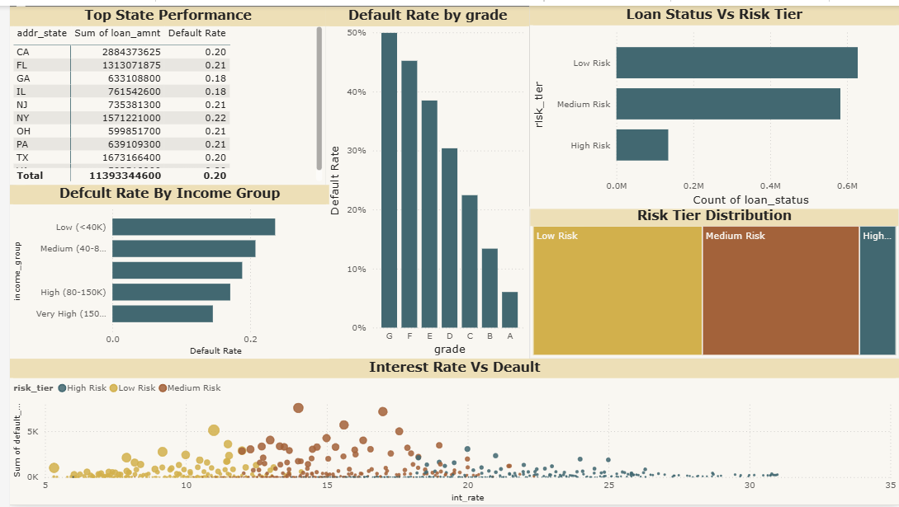
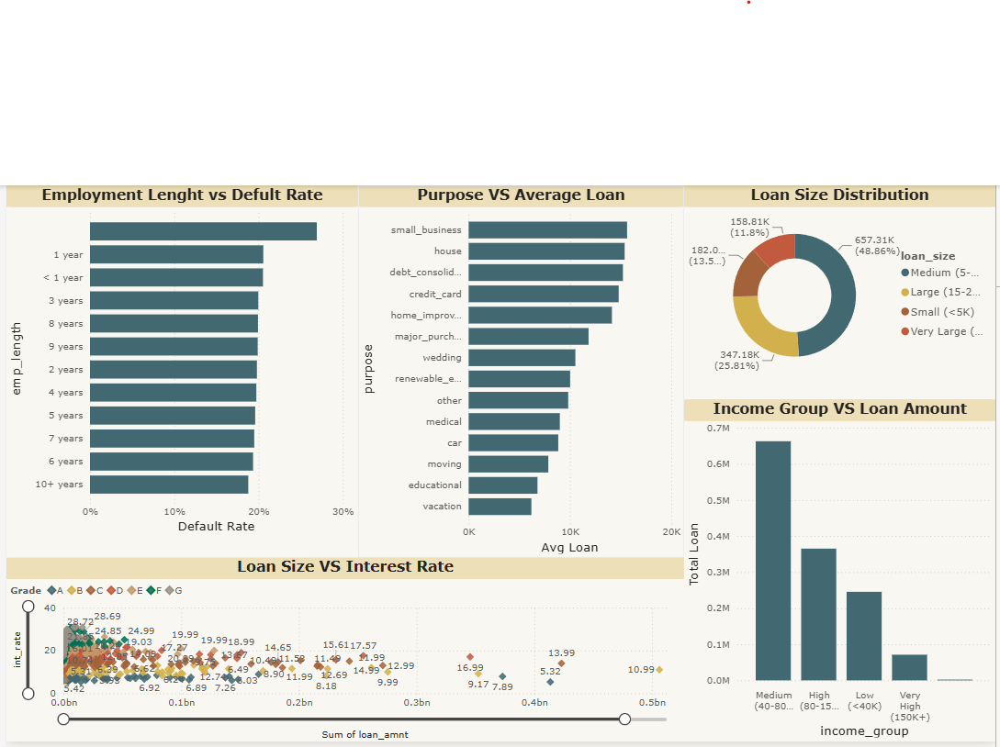

# 🏦 Bank Loan Risk Analysis | Python • SQL • Power BI

> An end-to-end Data Analytics project that analyzes bank loan applications, borrower risk, loan performance, and approval trends using **Python**, **MySQL**, and **Power BI**.


---

# 📌 Project Overview

Financial institutions receive thousands of loan applications every month. Understanding borrower profiles, loan approval trends, default risks, and repayment behavior is essential for making informed lending decisions.

This project demonstrates an **end-to-end Data Analytics workflow**:

- Data Cleaning using Python
- Data Analysis using SQL
- Interactive Dashboard Development using Power BI
- Business Insights & KPI Reporting

---

# 🎯 Business Objectives

- Analyze loan application trends.
- Understand borrower demographics.
- Identify high-risk loan segments.
- Monitor loan approval and rejection rates.
- Evaluate funded amount and repayment performance.
- Build an interactive dashboard for business users.

---

# 🛠 Tech Stack

- Python
- Pandas
- NumPy
- MySQL
- Power BI
- DAX

---

# 📂 Project Workflow

```
Raw Dataset
      │
      ▼
Python
(Data Cleaning & Preprocessing)
      │
      ▼
MySQL
(Business Analysis using SQL)
      │
      ▼
Power BI
(Interactive Dashboard)
      │
      ▼
Business Insights
```

---

# 📁 Project Structure

```
Bank-Loan-Risk-Analysis-Python-SQL-Power-BI
│
├── Dataset
│
├── Python
│     ├── Data Cleaning.ipynb
│
├── SQL
│     ├── SQL Queries.sql
│
├── Power BI
│     ├── Bank Loan Dashboard.pbix
│
├── Dashboard Screenshots
│
├── README.md
```

---

# 🐍 Python

Data Cleaning Tasks

- Removed duplicate records
- Handled missing values
- Corrected data types
- Feature engineering
- Standardized column names
- Exported cleaned dataset

Libraries Used

- Pandas
- NumPy

---

# 🗄 SQL Analysis

Business Questions Solved

- Total Loan Applications
- Funded Amount
- Total Amount Received
- Loan Status Distribution
- Monthly Loan Trends
- Loan Purpose Analysis
- State-wise Loan Analysis
- Home Ownership Analysis
- Interest Rate Analysis
- Grade-wise Loan Analysis

---

# 📊 Power BI Dashboard

Dashboard includes

✅ Executive KPI Cards

- Total Loan Applications
- Total Funded Amount
- Total Amount Received
- Average Interest Rate
- Average DTI
- Loan Approval Rate

✅ Interactive Visualizations

- Loan Status Analysis
- Monthly Loan Trend
- State-wise Loan Distribution
- Loan Purpose Analysis
- Home Ownership Analysis
- Grade Analysis
- Term Analysis
- Employee Length Analysis
- Good vs Bad Loan Comparison

---

# 📷 Dashboard Preview

## Executive Dashboard



---

## Loan Analysis Dashboard



---

## Financial Insights Dashboard



---

# 📈 Key Business Insights

- Most loan applications come from borrowers with mortgage ownership.
- Fully paid loans significantly outnumber charged-off loans.
- Debt consolidation is the most common loan purpose.
- Loan approval trends vary across employment length.
- Certain grades exhibit higher default risk.
- Interest rates increase with higher borrower risk.

---

# 📊 KPIs

| KPI | Description |
|------|-------------|
| Total Applications | Total number of loan applications |
| Funded Amount | Total loan amount funded |
| Amount Received | Total repayments received |
| Avg Interest Rate | Average borrower interest rate |
| Avg DTI | Average Debt-to-Income Ratio |
| Good Loan % | Percentage of fully paid loans |
| Bad Loan % | Percentage of charged-off loans |

---

# 💡 Skills Demonstrated

- Data Cleaning
- Exploratory Data Analysis
- SQL Query Writing
- Data Visualization
- DAX
- Dashboard Design
- Business Analysis
- KPI Reporting
- Financial Analytics

---

# 🚀 Future Improvements

- Predict loan default using Machine Learning
- Build forecasting dashboard
- Add customer segmentation
- Deploy dashboard online

---

# 📬 Contact

**Dharmveer Patel**

📧 Email: 04dharmveerpatel@gmail.com

🐙 GitHub: https://github.com/dharmveer04

---

# ⭐ If you found this project useful, please consider giving it a star.
